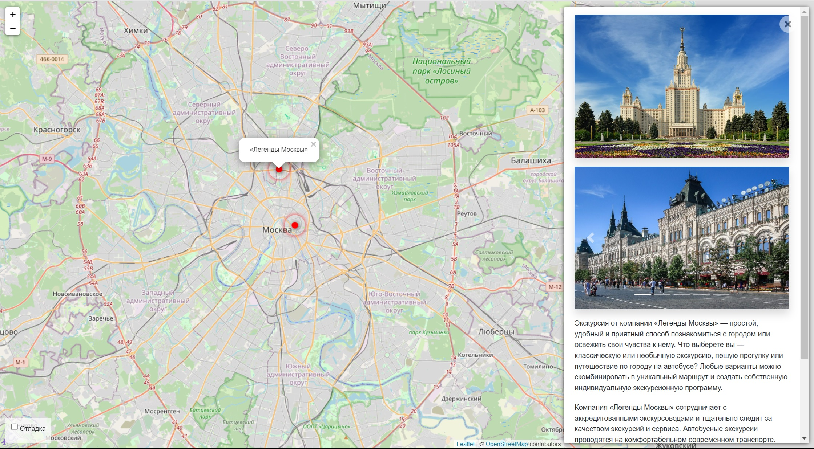
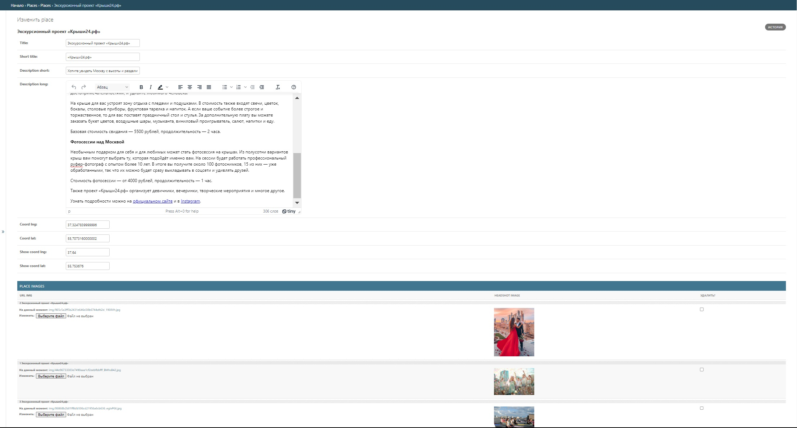

# Яндекс афиша

Интерактивная карта Москвы, на которой будут все известные виды активного 
отдыха с подробными описаниями и комментариями.

---




#### [Демо сайта]()

---

### Как запустить проект

* Клонируйте репозиторий
* Перейдите в каталок с файлом [manage.py](manage.py)
* Создайте и активируйте виртуальное пространство
```
python3 -m venv venv
source venv/bin/activate
```
* Установите зависимости
```
pip install -r requirements.txt
```
* Выполните миграции
```
python3 manage.py makemigrations
python3 manage.py migrate
```
* Запустите вебсервер командой
```
python3 manage.py runserver
```
* Откройте в браузере [сайт](http://127.0.0.1:8000/)

---

### Источники данных

Фронтенд получает данные из JSON объекта, который формируется на бэкэнде сайта. 
Он содержит полный список объектов на карте. И передается внутрь 
тега ```script```. В свою очередь данные для JSON объекта берутся из базы данных.

JSON объект имеет следующий вид
```json
{
    "type": "FeatureCollection",
    "features": [
      {
        "type": "Feature",
        "geometry": {
          "type": "Point",
          "coordinates": [37.62, 55.793676]
        },
        "properties": {
          // Специфичные для этого сайта данные
          "title": "Легенды Москвы",
          "placeId": "moscow_legends",
          "detailsUrl": "places/2" //2 - id объкта в базе данных
        }
      },
      // ...
    ]
  }
```
Данные записаны в [формате GeoJSON](https://ru.wikipedia.org/wiki/GeoJSON). Все поля здесь стандартные, 
кроме properties. Внутри properties лежат специфичные для проекта данные:

* ```title``` — название локации
* ```placeId``` — уникальный идентификатор локации, строка или число
* ```detailsUrl``` — адрес для получения доп. сведений о локации в JSON формате

Значение поля ```placeId``` может быть либо строкой, либо числом. Само значение не играет большой роли, 
важно лишь чтобы оно было уникальным. Фронтенд использует placeId чтобы избавиться от дубликатов — 
если у двух локаций одинаковый placeId, то значит это одно и то же место.

Адреса в поле ```detailsUrl``` c подробными сведениями о локации. 
Каждый раз, когда пользователь выбирает локацию на карте, JS код отправляет запрос на сервер и получает 
картинки, текст и прочую информацию об объекте, данные для JSON объекта берутся из базы данных. 
Формат ответа сервера такой:

```json
{
    "title": "Экскурсионный проект «Крыши24.рф»",
    "imgs": [
      "/media/img/0a79676b3d5e3b394717b4bf2e610a57_reDExkX.jpg",
      "/media/img/1e27f507cb72e76b604adbe5e7b5f315_VpVLMym.jpg",
      "/media/img/4f793576c79c1cbe68b73800ae06f06f_pW6W1lZ.jpg"
    ],
    "description_short": "Хотите увидеть Москву с высоты птичьего полёта?",
    "description_long": "<p>Проект «Крыши24.рф» проводит экскурсии ...</p>",
    "coordinates": {
        "lat": 55.753676,
        "lng": 37.64
    }
}
```
---
Наполнение базы данных производится через админ-панель фреймворка Django.
Для управления админ-панелью создайте пользователя с правами администратора
```
python3 manage.py createsuperuser
```

Внешний вид админ-панели



### Используемые библиотеки

---

Frontend:
* [Leaflet](https://leafletjs.com) - отрисовка карты
* [loglevel](https://www.npmjs.com/package/loglevel) - для логгирования
* [Bootstrap](https://getbootstrap.com/) - CSS библиотека
* [Vue.js](https://ru.vuejs.org/) — реактивные шаблоны на фронтенде

Backend
* [Django 5.1]() - серверная часть сайта
* [django-admin-sortable2](https://django-admin-sortable2.readthedocs.io/en/latest/) - 
перетаскивание фото в админ-панели 
* [django-tinymce](https://django-tinymce.readthedocs.io/en/latest/) - удобное редактирование 
описания
* [pillow](https://pillow.readthedocs.io/en/stable/) - библиотека для работы с изображениями
* [pydantic-settings](https://docs.pydantic.dev/latest/concepts/pydantic_settings/) - 
библиотека для работы с переменными окружения

### Цели проекта

---

Код написан как домашнее задание к курсу Devman "Python разработчик от Junior до Middle"